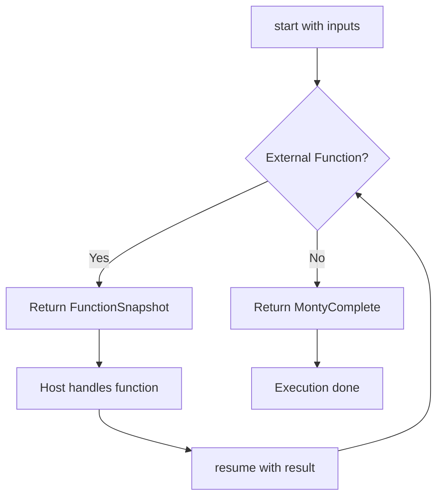

## Overview

Monty supports two distinct execution modes:

1. **Simple Execution** (`run()`): Execute code to completion in one call
2. **Iterative Execution** (`start()`/`resume()`): Pause at external function calls and resume later

## Simple Execution with run()

Use `run()` when your code doesn't call external functions or when you can provide all external functions upfront.

<CodeGroup>
```python Python
import pydantic_monty

# Pure computation - no external functions
m = pydantic_monty.Monty('x ** 2 + y', inputs=['x', 'y'])
result = m.run(inputs={'x': 5, 'y': 3})
print(result)  # 28

# With external functions provided
code = "fetch(url) + transform(data)"
m = pydantic_monty.Monty(code, inputs=['url', 'data'])

result = m.run(
    inputs={'url': 'https://api.example.com', 'data': 'test'},
    external_functions={
        'fetch': lambda url: f'fetched from {url}',
        'transform': lambda data: data.upper()
    }
)
print(result)
```

```typescript TypeScript
import { Monty } from '@pydantic/monty';

// Pure computation
const m = new Monty('x ** 2 + y', { inputs: ['x', 'y'] });
const result = m.run({ inputs: { x: 5, y: 3 } });
console.log(result); // 28
```

```rust Rust
use monty::{MontyRun, MontyObject, NoLimitTracker, PrintWriter};

// Pure computation
let code = "x ** 2 + y";
let runner = MontyRun::new(
    code.to_owned(),
    "script.py",
    vec!["x".to_owned(), "y".to_owned()]
).unwrap();

let result = runner.run(
    vec![MontyObject::Int(5), MontyObject::Int(3)],
    NoLimitTracker,
    &mut PrintWriter::Stdout
).unwrap();

assert_eq!(result, MontyObject::Int(28));
```
</CodeGroup>

### When to Use run()

- Pure computations without external dependencies
- All external functions can be provided synchronously
- You want the simplest API
- No need for execution state serialization

## Iterative Execution with start() and resume()

Use `start()` and `resume()` when you need control over external function calls, want to serialize execution state, or handle async operations.

### Basic Pattern

<CodeGroup>
```python Python
import pydantic_monty

code = """
data = fetch(url)
processed = transform(data)
len(processed)
"""

m = pydantic_monty.Monty(code, inputs=['url'])

# Start execution
progress = m.start(inputs={'url': 'https://example.com'})

while True:
    if isinstance(progress, pydantic_monty.FunctionSnapshot):
        print(f"Calling: {progress.function_name}")
        print(f"Args: {progress.args}")
        
        # Handle the external function call
        if progress.function_name == 'fetch':
            result = 'example data'
        elif progress.function_name == 'transform':
            result = progress.args[0].upper()
        
        # Resume with the result
        progress = progress.resume(return_value=result)
    
    elif isinstance(progress, pydantic_monty.MontyComplete):
        print(f"Final result: {progress.output}")
        break
```

```typescript TypeScript
import { Monty, MontySnapshot, MontyComplete } from '@pydantic/monty';

const code = `
data = fetch(url)
processed = transform(data)
len(processed)
`;

const m = new Monty(code, {
  inputs: ['url'],
  externalFunctions: ['fetch', 'transform']
});

let progress = m.start({ inputs: { url: 'https://example.com' } });

while (true) {
  if (progress instanceof MontySnapshot) {
    console.log(`Calling: ${progress.functionName}`);
    
    // Handle external function
    let result;
    if (progress.functionName === 'fetch') {
      result = 'example data';
    } else if (progress.functionName === 'transform') {
      result = progress.args[0].toUpperCase();
    }
    
    progress = progress.resume({ returnValue: result });
  } else if (progress instanceof MontyComplete) {
    console.log(`Final result: ${progress.output}`);
    break;
  }
}
```
</CodeGroup>

### Understanding Execution Flow



## Execution State Types

### FunctionSnapshot

Execution paused at an external function call:

```python
if isinstance(progress, pydantic_monty.FunctionSnapshot):
    # Access call details
    function_name: str = progress.function_name
    args: tuple = progress.args
    kwargs: dict = progress.kwargs
    call_id: int = progress.call_id
    
    # Resume with result
    progress = progress.resume(return_value=result)
    # Or resume with error
    progress = progress.resume(error=MontyException(...))
```

### OsSnapshot

Execution paused for OS operation (filesystem, network):

```python
if isinstance(progress, pydantic_monty.OsSnapshot):
    # Check what OS operation is requested
    function: str = progress.function  # e.g., 'read_file', 'path_exists'
    args: tuple = progress.args
    
    # Handle the OS operation
    if progress.function == 'read_file':
        path = progress.args[0]
        content = your_safe_file_reader(path)
        progress = progress.resume(return_value=content)
```

### NameLookupSnapshot

Execution paused to resolve an undefined name:

```python
if isinstance(progress, pydantic_monty.NameLookupSnapshot):
    name: str = progress.name
    
    # Resolve the name
    if name in your_allowed_functions:
        value = your_allowed_functions[name]
        progress = progress.resume(value=value)
    else:
        # Will raise NameError
        progress = progress.resume_undefined()
```

### MontyComplete

Execution finished successfully:

```python
if isinstance(progress, pydantic_monty.MontyComplete):
    final_result = progress.output
    print(f"Done: {final_result}")
```

## Async External Functions

Monty supports async/await patterns through iterative execution:

```python
import asyncio
import pydantic_monty

code = """
result1 = await fetch(url1)
result2 = await fetch(url2)
result1 + result2
"""

m = pydantic_monty.Monty(code, inputs=['url1', 'url2'])

async def handle_execution():
    progress = m.start(inputs={
        'url1': 'https://api.example.com/1',
        'url2': 'https://api.example.com/2'
    })
    
    while isinstance(progress, pydantic_monty.FunctionSnapshot):
        # Can await async operations
        result = await async_fetch(progress.args[0])
        progress = progress.resume(return_value=result)
    
    return progress.output

result = asyncio.run(handle_execution())
```

<Note>
See the [Async Execution](/guides/async-execution) guide for more details on handling concurrent async operations.
</Note>

## Execution State Inspection

With iterative execution, you can inspect and control every external interaction:

```python
# Log all external calls
if isinstance(progress, pydantic_monty.FunctionSnapshot):
    logger.info(f"External call: {progress.function_name}")
    logger.info(f"Arguments: {progress.args}")
    logger.info(f"Call ID: {progress.call_id}")
    
    # Apply security checks
    if not is_allowed_function(progress.function_name):
        progress = progress.resume(
            error=pydantic_monty.MontyException(
                'SecurityError',
                f'Function {progress.function_name} not allowed'
            )
        )
    else:
        result = execute_safely(progress.function_name, progress.args)
        progress = progress.resume(return_value=result)
```

## Performance Comparison

### run() - Simple Execution

- **Startup**: ~0.06ms (microseconds)
- **Overhead**: Minimal - single function call
- **Use when**: Pure computation or all external functions available upfront

### start()/resume() - Iterative Execution

- **Startup**: ~0.06ms (same as run())
- **Overhead**: Small per external call (snapshot creation)
- **Use when**: Need control over external calls, serialization, or async handling

<Tip>
Both modes start equally fast. Use `run()` for simplicity, `start()`/`resume()` for control.
</Tip>

## Choosing the Right Mode

<CardGroup cols={2}>
  <Card title="Use run()" icon="play">
    - Pure computations
    - Sync external functions
    - Simpler code
    - No serialization needed
  </Card>
  
  <Card title="Use start()/resume()" icon="rotate">
    - Need execution control
    - Async operations
    - State serialization
    - Security logging
    - Custom error handling
  </Card>
</CardGroup>

## Next Steps

<CardGroup cols={2}>
  <Card title="Serialization" icon="floppy-disk" href="/concepts/serialization">
    Learn how to serialize and restore execution state
  </Card>
  
  <Card title="Resource Limits" icon="gauge" href="/concepts/resource-limits">
    Configure memory, time, and recursion limits
  </Card>
</CardGroup>
